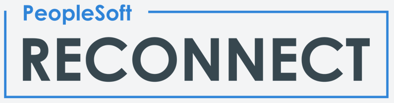

class: center, middle

# Taking PeopleSoft Swimming  TEST
## in an OCI Instance Pool

Kyle Benson

Session ID: **101340**

https://wiki.psadmin.io/talk.psft-oci-instance-pool

???

This is the title slide

---

# Agenda

1. Introduction
1. PeopleSoft Domain Clustering 
1. OCI Instance Pool
1. Three Approaches to Instance Provisioning
    1. Straight DPK
    1. Shared Middleware
    1. Custom Image
---

# Q&A

**Session ID** 101340

**Slides** https://wiki.psadmin.io/talk.psft-oci-instance-pool

**Kyle Benson**
* [linkedin.com/in/kylebenson](https://www.linkedin.com/in/kylebenson)
* [twitter.com/kbenson](https://twitter.com/kbenson)
* [github.com/kbens](https://github.com/kbens)

* https://psadmin.io
* [twitter.com/psa_io](https://twitter.com/psa_io)
* [github.com/psadmin-io](https://github.com/psadmin-io)

